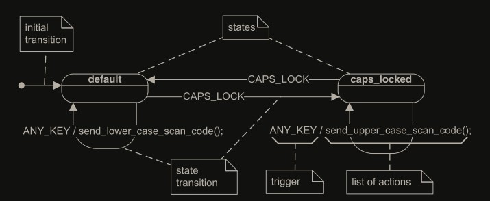

# 事件驱动状态机设计

## 总体设计思路

正常的轮询控制是有模块A和模块B，模块A一直等待模块B的状态，通过轮询的方式死等。

事件驱动模式中应该为模块A在需要数据时直接进入休眠状态，放弃CPU，不阻塞也不轮询，其无需关心B的状态，模块B也无需关心模块A的状态，当数据就绪时其就向模块A发送一个包含数据的事件并唤醒模块A，此时模块A才执行后续流程，这个过程中A不再控制着B，而是反过来由B触发A的动作，这就是控制的倒置。

操作系统领域有个类似的概念，就是信号量，当模块A需要数据时可以利用信号量休眠，由模块B在数据准备就绪后修改信号量唤醒A。但这种方式只是简化版本，其同一时间只能监听一种事件，当模块A同时等待多个事件时就难以用信号量实现。另一个方式就是回调，模块A可以将部分必要操作作为回调函数传递给模块B，这样模块B准备好数据后就可以执行该回调代表模块A处理任务。

## UML状态机概念

`状态` ：主要依靠一个状态变量，它能被假定为一些有限的已经被确定的值，比如手机的勿扰模式包括了不播放声音、不震动、不自动亮屏等一些设置项，此时对于通知或者来电的处理和正常模式不一样，原来要判断很多设置项，现在只要判断是否是勿扰模式这一个状态就行。

`状态图` ：

    状态：圆角矩形

    状态名：圆角矩形里的标签

    状态转换：箭头

    事件：箭头上的标签的/的前半部分，一般大写

    动作：箭头上的标签的/的后半部分

    初始转换：实心圆点加箭头

`事件` ：一个事件是对系统有重大意义的一个在时间和空间上所发生的事情。
UML 图中事件表示事件类型而不是实例，实际程序中判断的是事件类型实例化后的事件实例。

`动作和转换` ：从一个状态切换到另一个状态被称为状态转换，引发它的事件被称为触发事件 (triggering event) ，或简单的被称为触发 (trigger) 。

`运行-到-完成执行模型(Run-to-Completion Execution Model, RTC)`：在 RTC 模型里，系统在分散的不可分割的 RTC 步骤里处理事件。新到的事件不能中断当前事件的处理，而且必须被存储（通常是存储在一个事件队列里），直到状态机又变成空闲。这些语义完全避免了在一个单一的状态机里的任何内部并发问题。
实际上 RTC 步骤可以被抢占，只要抢占它的进程不会共享和该状态机相关的资源，抢占结束能恢复原始上下文就行。

## 状态机分类

`有限状态机(FSM)` ：行为的改变（例如，响应任何事件的改变）对应着状态改变，被称为状态转换。

`扩展状态机(ESM)` ：事件的发生并不意味着状态改变，通过定量的方式，让事件发生达到监护条件（如次数，为状态转换添加定量条件，如事件发送达到 1000 次条件才为真，才发生状态转换）才改变状态。

`层次式状态机(HSM)` ：子状态没有对应事件处理方法时，寻找父状态处理方法。不同的子状态复用了父状态的处理方法，类似于继承(抽象)

包含其他状态的状态被称为复合状态 (composite state) ，相对的，没有内部结构的状态被称为简单状态 (simple state)。一个嵌套的状态当它没有被其他状态包含时被称为直接子状态 (direct substate)，否则，它被归类于过渡性嵌套子状态 (transitively nested substate) 。

**行为继承 (Behavioral Inheritance)** ： 复用父类处理方法，相当于 OOP 中继承父类函数
状态的 LISKOV 替换原则 (LSP) ： 一个子状态的行为应该和超状态(父状态)一致。
Liskov 替换原则的核心是保持行为的兼容性，即子类不仅需要在语法上继承父类的结构，还需要在语义上符合父类的预期行为。
如果在状态 heating 意味着加热器开启，子状态（在不从状态 heating 转换出去的情况下）不能意味着加热器关闭。

**正交区域**： 当一个系统的行为被分解为**独立的并发性**的主动部分时，状态数目组合性增加，正交区域解决了这个常常碰到的问题。例如，除主键区外，一个计算机键盘有一个独立的数字键区。
尽管正交区域意味着执行时的独立性（也就是说有一些并发性）， UML 规范没有要求为每一个正交区域分配一个独立的执行线程（尽管可以这样做）。事实上最普通的情况是，这些正交区域在同一个线程里执行。UML 规范仅要求设计者在一个事件被派发到一些相关的正交区域时，不要依赖于任何特定的次序。

**进入和推出动作** ： UML 的状态图里的每个状态机都可以有可选的进入动作，它在进入一个状态时被执行；同时也可以有可选的退出动作，在退出一个状态时被执行。
无论一个状态被以什么方法进入或退出，所有它的进入和退出动作将被执行。(自动强制执行)
进入和退出动作的价值是它们提供了可担保的初始化和清理方法，非常像 OOP 里类的构造函数和析构函数

**内部转换动作** ： 一个事件造成一些内部动作被执行但是又不导致一个状态的改变（状态转换），也不执行任何进入退出动作。
当你在键盘上打字时，它通过产生不同的字符码来响应。然而，除非你敲击CapsLock键，键盘的状态不会改变（没有状态转换发生）。

和自转换相反，在执行内部转换时不会执行进入和退出动作，即使内部转换是从一个超过当前活动状态较高层的层次继承的。从超状态继承的内部转换在任何的嵌套层都如同它们被直接在当前活动状态被定义一样执行。

**转换的执行次序** ： 如果状态机有一个复合状态（它也可以被包含在一个更高层的复合状态， 并递归嵌套）里面的叶状态，所有的直接或间接包含这个叶状态 (leaf state)的复合状态都是活动的。而且， 因为在这个层次里的一些复合状态也许有正交区域，当前活动状态事件代表了一个树，从在根部的单一顶状态开始往下直到在这个叶的单一简单状态。

在 UML ，一个状态转换能直接连接任何两个状态。这两个状态也许是复合的状态，它们被定名一个转换的主源 (main source) 和主目标 (main target)。图 2.9 展示了一个简单的转换实例，并解释了在这个转换里的状态的角色。 UML 规范描叙了执行一个状态转换需要牵涉到以下的动作:

    1. 评估和转换联合的监护条件，如果监护条件为真则执行以下的步骤。
    2. 退出源状态配置。
    3. 执行和转换联合的动作。
    4. 进入到目的状态配置。

## UML定义事件

UML 规范定义了四种事件，通过具体的符号区分它们：

    signalEvent 代表一个特定的（异步）信号。它的格式是：信号名 ’(’ 逗号分开的变量表 ’)’ 。
    TimeEvnt 对一个特定的最后期限建模。它用关键词 after 标识，后面是一个具体指明时间量的表达式。时间从进入到以 TimeEvnt 为一个触发的状态开始计时。
    callEvent 代表了同步地调用一个特定操作的请求。它的格式是：操作名 ’(’ 逗号分开的变量表 ’)’ 。
    changeEvent 对一个明确的布尔表达式为真时出现的一个事件建模。它用关键词 when 标识，后面是一个布尔表达式。

本书描叙的 HSM 实现（见第四章）仅支持 SignalEvent 类型。第 2 部分描叙的实时框架增加了对 TimeEvent 类型的支持，但是 QF 里的 TimeEvent 需要明确的启动和解除，这和 UML 的 after 符号不兼容。因为 SignalEvent 多态性事件触发的固有的复杂性和非常高的性能开销，它也不被支持。

有时候，一个事件，在一个状态机正在某个状态中从而不能处理这个事件这种特别不方便的时刻到达。在很多情况下，事件的本性是它可以被（有限度的）推迟，直到系统进入到另一个状态，在那里它被更好的准备去处理这个原来的事件。

## 延迟事件

UML 状态机提供了一个特定的机制，用来在状态里延迟事件。在每一个状态，你能包含一个 deferred / [event list]。如果在当前状态的延迟事件列表中的一个事件出现，这个事件会被保留（延迟）给将来处理，直到进入到一个没有把它放在自己的延迟事件列表中的状态。在进入这种状态时， UML 状态机将自动的恢复任何被保留的事件，不再延迟它们，而像它们刚刚到达一样处理它们。

实现内为赋值标志位，不会被删除

## 伪状态

- 初始伪状态 (initial pseudostate)(显示为一个黑点)表示了一个初始转换的源。在一个复合状态里，可以有最多一个初始伪装态。从初始伪装态出发的转换可能有动作，但是没有触发或者监护条件。
- 选择伪状态 (choice pseudostate)(显示为一个菱形或空心圈)被用来进行动态条件分支。它允许转换的分裂到多个外向路径，因此决定使用哪一个路径取决于在相同的 RTC 步骤先前被执行的动作。
- 浅历史伪状态 (shallow-history pseudostate)
- 深历史伪状态 (deep-history pseudostate)
- 连接点伪状态 (junction pseudostate)
- 结合伪状态 (join pseudostate)
- 分支伪状态 (fork pseudostate)
