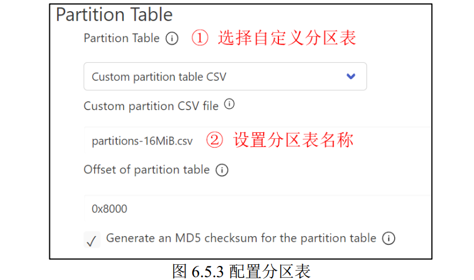
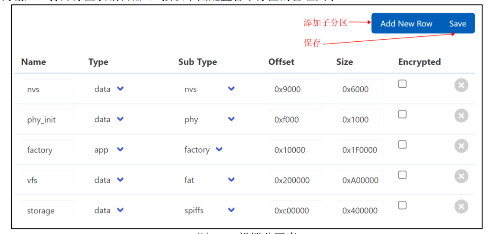
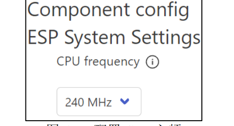
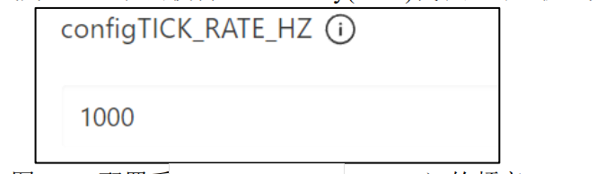
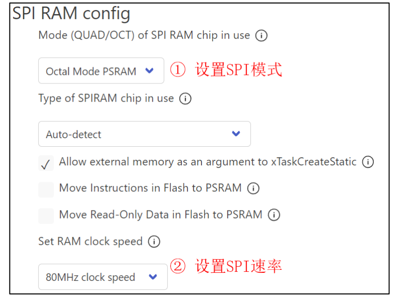

# ESP32完整开发指南

## 📋 概述

ESP32是乐鑫信息科技开发的一系列低功耗系统级芯片微控制器，集成了Wi-Fi和蓝牙功能。本指南将从开发环境搭建到高级应用开发，提供完整的ESP32学习路径。

## 🔧 开发环境搭建

### ESP32芯片系列对比

| 芯片型号 | CPU核心 | Wi-Fi | 蓝牙 | 特殊功能 | 适用场景 |
|---------|--------|-------|------|----------|----------|
| ESP32 | 双核Xtensa LX6 | 802.11 b/g/n | Classi### 2.3 分区表配置

分区表定义了Flash存储器的布局，包括引导程序、应用程序、数据存储等分区。

**内置分区表类型：**

```bash
# 单一应用分区表（默认）
CONFIG_PARTITION_TABLE_SINGLE_APP=y

# 双应用分区表（支持OTA更新）
CONFIG_PARTITION_TABLE_TWO_OTA=y

# 自定义分区表
CONFIG_PARTITION_TABLE_CUSTOM=y
CONFIG_PARTITION_TABLE_CUSTOM_FILENAME="partitions.csv"
```

**使用分区表编辑器：**

1. 按 `Ctrl+Shift+P` 打开命令面板
2. 搜索并选择："ESP-IDF: Open Partition Table Editor"
3. 可视化编辑分区布局

**自定义分区表示例 (partitions.csv)：**

```csv
# Name,   Type, SubType, Offset,  Size,     Flags
nvs,      data, nvs,     0x9000,  0x6000,
phy_init, data, phy,     0xf000,  0x1000,
factory,  app,  factory, 0x10000, 1M,
storage,  data, spiffs,  0x110000, 0xF0000,
```

**分区操作代码示例：**

```c
#include "esp_partition.h"
#include "esp_log.h"

void partition_example(void) {
    // 查找分区
    const esp_partition_t* partition = esp_partition_find_first(
        ESP_PARTITION_TYPE_DATA, 
        ESP_PARTITION_SUBTYPE_DATA_SPIFFS, 
        "storage");
    
    if (partition != NULL) {
        ESP_LOGI("PARTITION", "Found partition '%s' at offset 0x%x with size 0x%x", 
                 partition->label, partition->address, partition->size);
    }
    
    // 列举所有分区
    esp_partition_iterator_t it = esp_partition_find(ESP_PARTITION_TYPE_ANY, 
                                                    ESP_PARTITION_SUBTYPE_ANY, NULL);
    
    for (; it != NULL; it = esp_partition_next(it)) {
        const esp_partition_t* part = esp_partition_get(it);
        ESP_LOGI("PARTITION", "Partition: %s, type: %d, subtype: %d, size: %d KB", 
                 part->label, part->type, part->subtype, part->size / 1024);
    }
    esp_partition_iterator_release(it);
}
```

### 2.4 FreeRTOS时间基准配置

ESP-IDF基于FreeRTOS实时操作系统，时间配置影响系统性能和功耗。

**FreeRTOS配置路径：**
`Component config → FreeRTOS → Kernel`

**重要时间配置项：**

```bash
# FreeRTOS时钟频率（Hz）
CONFIG_FREERTOS_HZ=1000              # 1000Hz = 1ms时钟滴答
CONFIG_FREERTOS_HZ=100               # 100Hz = 10ms时钟滴答（低功耗）

# 看门狗配置
CONFIG_ESP_TASK_WDT=y                # 使能任务看门狗
CONFIG_ESP_TASK_WDT_TIMEOUT_S=5      # 看门狗超时时间（秒）

# 空闲任务钩子
CONFIG_FREERTOS_USE_IDLE_HOOK=y      # 使能空闲任务钩子

# 时钟源配置
CONFIG_ESP32_DEFAULT_CPU_FREQ_MHZ=240    # CPU频率240MHz
CONFIG_ESP32_DEFAULT_CPU_FREQ_MHZ=160    # CPU频率160MHz（节能）
CONFIG_ESP32_DEFAULT_CPU_FREQ_MHZ=80     # CPU频率80MHz（超低功耗）
```

**时间管理代码示例：**

```c
#include "freertos/FreeRTOS.h"
#include "freertos/task.h"
#include "esp_timer.h"
#include "esp_log.h"

// 高精度定时器回调
void timer_callback(void* arg) {
    ESP_LOGI("TIMER", "High resolution timer triggered");
}

void time_management_example(void) {
    // 1. FreeRTOS延时
    vTaskDelay(pdMS_TO_TICKS(1000));  // 延时1秒
    
    // 2. 获取系统运行时间
    TickType_t xTickCount = xTaskGetTickCount();
    ESP_LOGI("TIME", "System ticks: %d", xTickCount);
    
    // 3. 创建高精度定时器
    esp_timer_create_args_t timer_args = {
        .callback = &timer_callback,
        .name = "periodic_timer"
    };
    
    esp_timer_handle_t periodic_timer;
    esp_timer_create(&timer_args, &periodic_timer);
    esp_timer_start_periodic(periodic_timer, 1000000);  // 1秒周期
    
    // 4. 获取高精度时间戳
    int64_t time_us = esp_timer_get_time();
    ESP_LOGI("TIME", "High resolution timestamp: %lld us", time_us);
}
```

### 2.5 PSRAM配置详解

PSRAM（伪静态RAM）提供额外的内存空间，特别适用于大内存需求的应用。

**PSRAM配置路径：**
`Component config → ESP32-specific → Support for external, SPI-connected RAM`

**PSRAM配置选项：**

```bash
# 启用PSRAM支持
CONFIG_ESP32_SPIRAM_SUPPORT=y

# PSRAM类型选择
CONFIG_SPIRAM_TYPE_ESPPSRAM32=y      # ESP-PSRAM32
CONFIG_SPIRAM_TYPE_ESPPSRAM64=y      # ESP-PSRAM64

# PSRAM大小
CONFIG_SPIRAM_SIZE_4MB=y             # 4MB PSRAM
CONFIG_SPIRAM_SIZE_8MB=y             # 8MB PSRAM

# PSRAM速度
CONFIG_SPIRAM_SPEED_80M=y            # 80MHz（推荐）
CONFIG_SPIRAM_SPEED_40M=y            # 40MHz（兼容模式）

# PSRAM内存分配策略
CONFIG_SPIRAM_USE_MALLOC=y           # 允许malloc使用PSRAM
CONFIG_SPIRAM_USE_CAPS_ALLOC=y       # 使用特定API分配PSRAM
CONFIG_SPIRAM_USE_MEMMAP=y           # 将PSRAM映射到固定地址

# PSRAM缓存配置
CONFIG_SPIRAM_CACHE_WORKAROUND=y     # 启用缓存解决方案（修复硅缺陷）
```

**PSRAM使用代码示例：**

```c
#include "esp_heap_caps.h"
#include "esp_log.h"

void psram_example(void) {
    // 检查PSRAM是否可用
    size_t psram_size = heap_caps_get_total_size(MALLOC_CAP_SPIRAM);
    if (psram_size > 0) {
        ESP_LOGI("PSRAM", "PSRAM total size: %d bytes", psram_size);
        ESP_LOGI("PSRAM", "PSRAM free size: %d bytes", 
                 heap_caps_get_free_size(MALLOC_CAP_SPIRAM));
    } else {
        ESP_LOGW("PSRAM", "PSRAM not available");
        return;
    }
    
    // 从PSRAM分配内存
    void* psram_buffer = heap_caps_malloc(1024 * 1024, MALLOC_CAP_SPIRAM);
    if (psram_buffer != NULL) {
        ESP_LOGI("PSRAM", "Allocated 1MB from PSRAM at address: %p", psram_buffer);
        
        // 使用PSRAM缓冲区
        memset(psram_buffer, 0xAA, 1024 * 1024);
        
        // 释放PSRAM内存
        heap_caps_free(psram_buffer);
        ESP_LOGI("PSRAM", "PSRAM buffer freed");
    } else {
        ESP_LOGE("PSRAM", "Failed to allocate PSRAM");
    }
    
    // 打印内存统计信息
    ESP_LOGI("MEMORY", "DRAM free: %d bytes", heap_caps_get_free_size(MALLOC_CAP_8BIT));
    ESP_LOGI("MEMORY", "PSRAM free: %d bytes", heap_caps_get_free_size(MALLOC_CAP_SPIRAM));
}
```

## 三、基础开发实践

### 3.1 GPIO控制基础

```c
#include "driver/gpio.h"
#include "esp_log.h"

#define LED_PIN GPIO_NUM_2
#define BUTTON_PIN GPIO_NUM_0

void gpio_init_example(void) {
    // LED输出配置
    gpio_config_t led_config = {
        .pin_bit_mask = (1ULL << LED_PIN),
        .mode = GPIO_MODE_OUTPUT,
        .pull_up_en = GPIO_PULLUP_DISABLE,
        .pull_down_en = GPIO_PULLDOWN_DISABLE,
        .intr_type = GPIO_INTR_DISABLE
    };
    gpio_config(&led_config);
    
    // 按钮输入配置
    gpio_config_t button_config = {
        .pin_bit_mask = (1ULL << BUTTON_PIN),
        .mode = GPIO_MODE_INPUT,
        .pull_up_en = GPIO_PULLUP_ENABLE,
        .pull_down_en = GPIO_PULLDOWN_DISABLE,
        .intr_type = GPIO_INTR_NEGEDGE
    };
    gpio_config(&button_config);
    
    // 安装GPIO中断服务
    gpio_install_isr_service(0);
}

// GPIO中断处理函数
static void IRAM_ATTR gpio_isr_handler(void* arg) {
    uint32_t gpio_num = (uint32_t) arg;
    // 中断处理逻辑
    gpio_set_level(LED_PIN, !gpio_get_level(LED_PIN));
}

void gpio_interrupt_example(void) {
    gpio_isr_handler_add(BUTTON_PIN, gpio_isr_handler, (void*) BUTTON_PIN);
}
```

### 3.2 串口通信

```c
#include "driver/uart.h"
#include "esp_log.h"

#define UART_NUM UART_NUM_0
#define BUF_SIZE 1024

void uart_init_example(void) {
    uart_config_t uart_config = {
        .baud_rate = 115200,
        .data_bits = UART_DATA_8_BITS,
        .parity = UART_PARITY_DISABLE,
        .stop_bits = UART_STOP_BITS_1,
        .flow_ctrl = UART_HW_FLOWCTRL_DISABLE,
        .source_clk = UART_SCLK_APB,
    };
    
    // 安装UART驱动
    uart_driver_install(UART_NUM, BUF_SIZE * 2, 0, 0, NULL, 0);
    uart_param_config(UART_NUM, &uart_config);
    uart_set_pin(UART_NUM, UART_PIN_NO_CHANGE, UART_PIN_NO_CHANGE, 
                 UART_PIN_NO_CHANGE, UART_PIN_NO_CHANGE);
}

void uart_communication_task(void *pvParameters) {
    uint8_t* data = (uint8_t*) malloc(BUF_SIZE);
    
    while (1) {
        // 读取数据
        int len = uart_read_bytes(UART_NUM, data, BUF_SIZE, 20 / portTICK_RATE_MS);
        if (len > 0) {
            data[len] = '\0';
            ESP_LOGI("UART", "Received: %s", data);
            
            // 回显数据
            uart_write_bytes(UART_NUM, (const char*) data, len);
        }
        vTaskDelay(10 / portTICK_RATE_MS);
    }
    
    free(data);
}
```

## 🎯 深入学习模块

- [WiFi与网络编程](WiFi与网络编程.md) - 完整的WiFi连接和网络通信指南
- [蓝牙BLE开发](蓝牙BLE开发.md) - Bluetooth Low Energy开发完整教程
- [传感器接口与数据采集](传感器接口与数据采集.md) - 多种传感器接口协议和数据采集系统
- [实时操作系统与多任务编程](实时操作系统与多任务编程.md) - FreeRTOS任务管理和同步机制详解

---

> **ESP32开发总结**：ESP32是功能强大的IoT开发平台，本指南涵盖了从基础环境搭建到高级应用开发的完整流程。掌握这些技术，你将能够开发出专业级的ESP32应用项目，包括智能家居、工业控制、物联网节点等各种应用场景。
``` 经典版本 | 通用IoT应用 |
| ESP32-S2 | 单核Xtensa LX7 | 802.11 b/g/n | 无 | USB OTG | USB应用 |
| ESP32-S3 | 双核Xtensa LX7 | 802.11 b/g/n | BLE 5.0 | AI加速、LCD | AI和显示应用 |
| ESP32-C3 | 单核RISC-V | 802.11 b/g/n | BLE 5.0 | RISC-V架构 | 成本敏感应用 |
| ESP32-C6 | 单核RISC-V | 802.11 ax | BLE 5.0 + 802.15.4 | Wi-Fi 6、Zigbee | 新一代IoT |

## 一、VScode开发环境配置

### 1.1 ESP-IDF扩展安装

```bash
# 1. 安装VSCode ESP-IDF扩展
# 在VSCode扩展市场搜索并安装：Espressif IDF

# 2. 配置ESP-IDF路径
# Ctrl+Shift+P -> ESP-IDF: Configure ESP-IDF extension
# 选择ESP-IDF版本（推荐v5.1或更高版本）
```

### 1.2 调试配置 - launch.json

参考官方文档：[ESP-IDF调试指南](https://github.com/espressif/vscode-esp-idf-extension/blob/master/docs/DEBUGGING.md)

**Microsoft C/C++ Extension 调试配置：**

```json
{
  "version": "0.2.0",
  "configurations": [
    {
      "name": "ESP32 GDB Debug",
      "type": "cppdbg",
      "request": "launch",
      "MIMode": "gdb",
      "miDebuggerPath": "${command:espIdf.getToolchainGdb}",
      "program": "${workspaceFolder}/build/${command:espIdf.getProjectName}.elf",
      "windows": {
        "program": "${workspaceFolder}\\build\\${command:espIdf.getProjectName}.elf"
      },
      "cwd": "${workspaceFolder}",
      "environment": [
        { "name": "PATH", "value": "${config:idf.customExtraPaths}" }
      ],
      "setupCommands": [
        { "text": "set remotetimeout 20" },
        { "text": "set serial baud 115200" }
      ],
      "postRemoteConnectCommands": [
        { "text": "mon reset halt" },
        { "text": "maintenance flush register-cache" },
        { "text": "thb app_main" }
      ],
      "externalConsole": false,
      "logging": {
        "engineLogging": true,
        "programOutput": true,
        "exceptions": true
      },
      "preLaunchTask": "ESP-IDF: Build project"
    }
  ]
}
```

**ESP-IDF扩展内置调试配置：**

```json
{
  "name": "ESP-IDF Debug",
  "type": "espidf",
  "request": "launch"
}
```

### 1.3 任务配置 - tasks.json

```json
{
  "version": "2.0.0",
  "tasks": [
    {
      "label": "ESP-IDF: Build project",
      "type": "shell",
      "command": "${command:espIdf.buildDevice}",
      "group": {
        "kind": "build",
        "isDefault": true
      },
      "presentation": {
        "echo": true,
        "reveal": "always",
        "focus": false,
        "panel": "shared"
      },
      "problemMatcher": "$gcc"
    },
    {
      "label": "ESP-IDF: Flash device",
      "type": "shell",
      "command": "${command:espIdf.flashDevice}",
      "group": "build",
      "dependsOn": "ESP-IDF: Build project"
    },
    {
      "label": "ESP-IDF: Monitor device",
      "type": "shell",
      "command": "${command:espIdf.monitorDevice}",
      "group": "build",
      "isBackground": true
    },
    {
      "label": "ESP-IDF: Clean project",
      "type": "shell",
      "command": "${command:espIdf.cleanDevice}",
      "group": "build"
    }
  ]
}
```
### 1.4 OpenOCD配置文件

OpenOCD（开放片上调试器）用于ESP32的JTAG调试。

**常用配置文件位置：**

| 芯片型号 | 配置文件路径 | 说明 |
|---------|-------------|------|
| ESP32 | `board/esp32-wrover-kit-3.3v.cfg` | 经典ESP32开发板 |
| ESP32-S2 | `board/esp32s2-kaluga-1.cfg` | ESP32-S2开发板 |
| ESP32-S3 | `board/esp32s3-builtin.cfg` | ESP32-S3内置JTAG |
| ESP32-C3 | `board/esp32c3-builtin.cfg` | ESP32-C3内置JTAG |
| ESP32-C6 | `board/esp32c6-builtin.cfg` | ESP32-C6内置JTAG |

**查找配置文件方法：**

1. 访问[ESP-IDF JTAG调试文档](https://docs.espressif.com/projects/esp-idf/zh_CN/latest/esp32s3/api-guides/jtag-debugging/index.html)
2. 搜索"运行OpenOCD"章节
3. 根据具体芯片型号选择对应配置

**自定义OpenOCD配置示例：**

```tcl
# 自定义esp32s3.cfg
source [find target/esp32s3.cfg]

# 设置适配器速度
adapter speed 20000

# Flash配置
set ESP32_FLASH_VOLTAGE 3.3

# 复位配置
reset_config trst_and_srst

# 初始化脚本
init
reset halt
```

### 1.5 设备连接和端口配置

```bash
# 1. 查看可用串口
idf.py -p PORT monitor

# Windows下常见端口：COM3, COM4, COM5等
# Linux下常见端口：/dev/ttyUSB0, /dev/ttyACM0等
# macOS下常见端口：/dev/cu.usbserial-*

# 2. 设置默认端口（在项目根目录创建sdkconfig.defaults）
CONFIG_ESPTOOLPY_PORT="COM3"

# 3. 临时指定端口
idf.py -p COM3 flash monitor

# 4. 检查设备连接
idf.py -p COM3 chip_id
```

## 二、ESP-IDF SDK详细配置

### 2.1 项目结构和配置系统

**标准ESP-IDF项目结构：**

```
my_project/
├── CMakeLists.txt              # 顶层CMake文件
├── sdkconfig                   # 项目配置文件（自动生成）
├── sdkconfig.defaults          # 默认配置
├── partitions.csv              # 分区表文件
├── main/                       # 主应用代码
│   ├── CMakeLists.txt
│   ├── main.c
│   └── component.mk
├── components/                 # 自定义组件
│   └── my_component/
│       ├── CMakeLists.txt
│       ├── include/
│       └── src/
└── build/                      # 构建输出目录
```

**配置系统命令：**

```bash
# 图形化配置菜单
idf.py menuconfig

# 保存当前配置为默认配置
cp sdkconfig sdkconfig.defaults

# 重置为默认配置
idf.py reconfigure

# 清理配置
idf.py clean
rm sdkconfig
```

### 2.2 Flash存储器配置

Flash存储器是ESP32存储程序和数据的主要存储介质。

**QSPI Flash设置步骤：**

1. 打开配置菜单：`idf.py menuconfig`
2. 导航到：`Serial flasher config → Flash size`

**常用Flash配置选项：**

```bash
# Flash大小配置
CONFIG_ESPTOOLPY_FLASHSIZE_4MB=y    # 4MB Flash
CONFIG_ESPTOOLPY_FLASHSIZE_8MB=y    # 8MB Flash
CONFIG_ESPTOOLPY_FLASHSIZE_16MB=y   # 16MB Flash

# Flash模式配置
CONFIG_ESPTOOLPY_FLASHMODE_QIO=y    # QIO模式（最快）
CONFIG_ESPTOOLPY_FLASHMODE_QOUT=y   # QOUT模式
CONFIG_ESPTOOLPY_FLASHMODE_DIO=y    # DIO模式
CONFIG_ESPTOOLPY_FLASHMODE_DOUT=y   # DOUT模式（最兼容）

# Flash频率配置
CONFIG_ESPTOOLPY_FLASHFREQ_80M=y    # 80MHz（推荐）
CONFIG_ESPTOOLPY_FLASHFREQ_40M=y    # 40MHz（兼容模式）
CONFIG_ESPTOOLPY_FLASHFREQ_26M=y    # 26MHz（低速模式）

# Flash电压配置
CONFIG_ESPTOOLPY_FLASHVOLTAGE_33=y  # 3.3V（标准）
CONFIG_ESPTOOLPY_FLASHVOLTAGE_18=y  # 1.8V（低功耗）
```

**Flash检测和测试：**

```c
#include "esp_flash.h"
#include "esp_log.h"

void flash_info_example(void) {
    const esp_flash_t* flash = esp_flash_default_chip;
    uint32_t flash_size;
    
    // 获取Flash大小
    esp_flash_get_size(flash, &flash_size);
    ESP_LOGI("FLASH", "Flash size: %u MB", flash_size / (1024 * 1024));
    
    // 获取Flash芯片ID
    uint32_t chip_id;
    esp_flash_get_chip_id(flash, &chip_id);
    ESP_LOGI("FLASH", "Flash chip ID: 0x%08X", chip_id);
}
```
## 2.2 分区表配置

用分区别表编辑器进行编辑，按下“Ctrl+Shift+P”快捷键打开命令面板，并在搜索栏内输入“打开分区表编辑器”

## 2.3 配置freeRTOS的时间基准和cpu的时间基准


## 2.4 配置PSRAM



