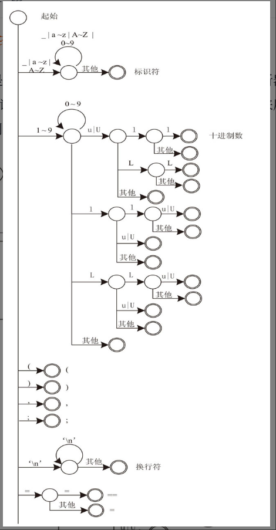
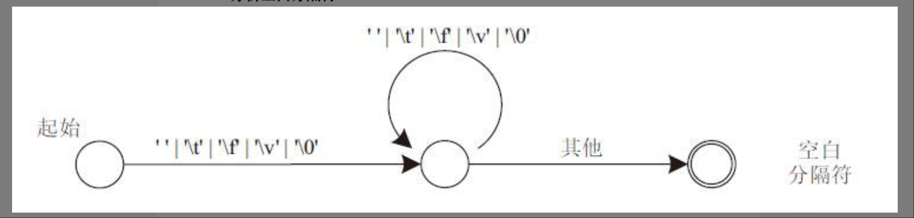
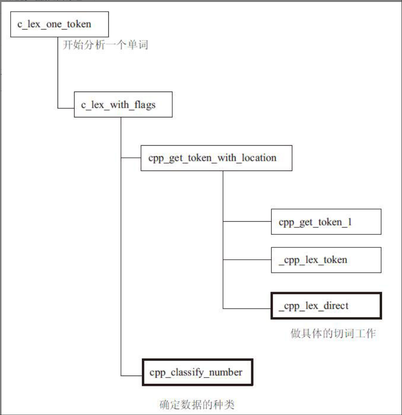

# 词法分析

## 词法解析过程

空白分隔符（）不属于C语言中符号的实际内容，遇到它后，会直接将其当作空白字符跳过，即跳转到skipped_white这个点，回到初始状态，情景如图2-42所示。

## 编译器原理解析

总体而言，词法解析的过程是一个状态机的转换过程。

总共分为6种

1. 空白符号`'\t' '\f' ' ' '\v' '\0'`：空白分隔符不属于C语言中符号的实际内容，遇到它后，会直接将其当作空白字符跳过，即跳转到skipped_white这个点，回到初始状态，情景如图2-42所示。
2. 换行符 `\n`：换行符也不属于实际的符号内容，从代码中可以看到，没有对这个字符做什么符号属性标记，遇到它后跳转到回到初始状态。
3. 数字符号 `1 2 3 4 5 6 7 8 9 0 .`：根据C语言规则，如果符号的第一个字符是0到9中的任意一个，该符号就是数字，如果第一个字符是“.”​，就要看紧跟着的字符，如果仍是0到9中的任意一个，也表示该符号是数字，是浮点型数字。同时，数字还需要分析进制信息。
4. 字符或者字符串 ：如果符号的第一个字符如果是“L”​、​“u”​、​“U”或“R”（**C语言的字符串标准，表征UTF-16 UTF-32等类型的字符串常量**）​，可能是标识符，也可能是字符串，程序中先分析它是不是字符串。符号的第一个字符如果是“\'”或“"”​，就可以确定符号是字符或字符串，进入lex_string函数来分析字符串内容。
5. 标识符 ：对于前面介绍的识别字符串，在识别到“L”​、​“u”​、​“U”或“R”时，如果当前符号不是字符串，那就是标识符，标识符的第一个字符是字母或下划线，这几个字符属于字母。
6. 运算符和分隔符：(1) 符号“/”​，它后面紧跟不同的字符来构成不同的运算符。​“/*”和“//”都是注释的意思，​“/*”和“*/”组合时可以注释掉它们之间的内容；​“//”用来注释掉当前行的内容；​“/=”是指对运算符左边和右边的操作数做除法，然后将数值赋给左边操作数；不是以上情况才能确定“/”就是除号。
(2)下面来看“<”​。如果此时正在进行预处理，​“<”可以用来引用某个头文件，它就不是小于号，否则，还要看它后面跟着什么字符，如果后续是“=”​，则构成“<=”运算符，即小于等于；如果后续仍然是“<”​，就还要往后看，如果后续仍然是“=”​，就是“<<=”​，即左移并赋值，如果后续没有“=”​，就是“<<”​，即左移；这些情况都排除掉，才可以确定“<”就是小于号。
(3)大于号的分析识别过程与小于号类似，如果后续是“=”​，则构成“>=”运算符，即大于等于；如果仍然跟着“>”​，就还要往后看，若后续是“=”​，就是“>>=”​，即右移并赋值，如果后续没有“=”​，就是“>>”​，即右移；这些情况都排除掉，才可以确定“>”就是大于号。
(4)看“%”​，情况比较简单，识别到“%”后，往后再看一个字符，如果是“=”​，就是“%=”​，即求余并赋值，否则就是求余。
(5)看“.”​。如果后面跟着的第二个和第三个字符都是“.”​，说明当前符号是“...”​，即缺省符，表示变参。

## Gcc源码解析

状态转换图的指导思想主要体现在架构图中_cpp_lex_direct函数和cpp_classify_number函数部分，其中_cpp_lex_direct函数完成了所有符号的识别，从初始状态到终态都是在这里完成的；数字的识别相对比较复杂，_cpp_lex_direct函数在识别到数字后，先将其存下来，然后在cpp_classify_number函数中详细甄别数字的具体类型和属性。除了这两个函数外，其他的部分，有些用来做预处理（我们会在第8章详细介绍预处理）​，另外一些则偏重于工程处理，比如符号识别出来后存储在哪里等。下面我们着重看这两个核心函数的处理过程。
